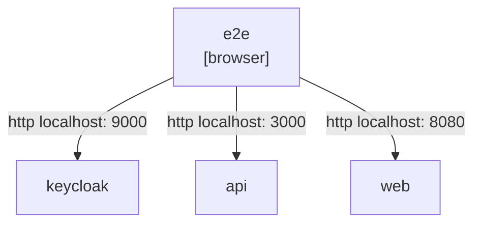
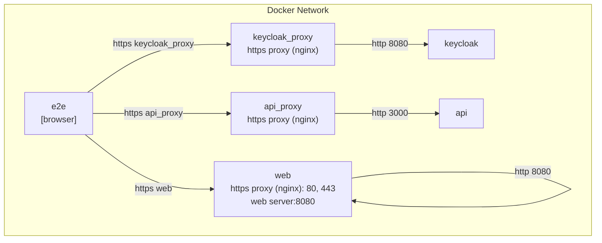

### Deployment views
On host, we have e2e, web, api and keycloak as below.



But in `docker-compose`, keycloak requires `https`. The deployment view has chaged as below.



more details at [รัน e2e test ที่ใช้ keycloak ใน docker-compose](https://medium.com/odds-team/%E0%B8%A3%E0%B8%B1%E0%B8%99-e2e-test-%E0%B8%97%E0%B8%B5%E0%B9%88%E0%B9%83%E0%B8%8A%E0%B9%89-keycloak-%E0%B9%83%E0%B8%99-docker-compose-a1d8e3eeebc4)

### How to debug?

```
docker-compose run --rm e2e_debug
```

then on host machine:

```
cd e2e
npx playwright show-report
```