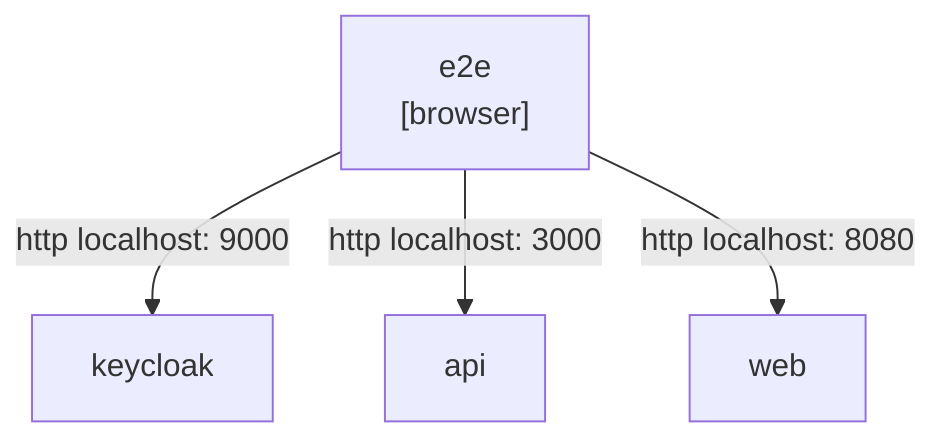
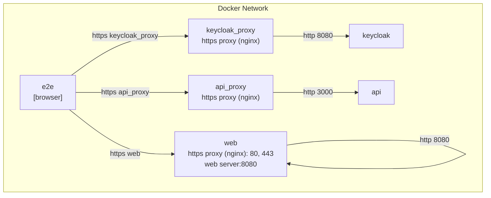

### Deployment view on host

### Deployment view in docker

preview in [Mermaid Live Editor](https://mermaid.live/edit) or use [plugin](https://marketplace.visualstudio.com/items?itemName=MermaidChart.vscode-mermaid-chart)