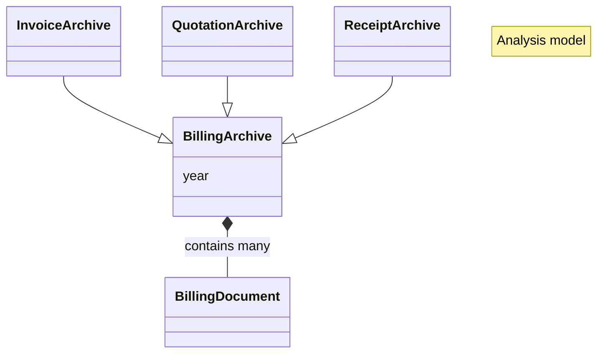
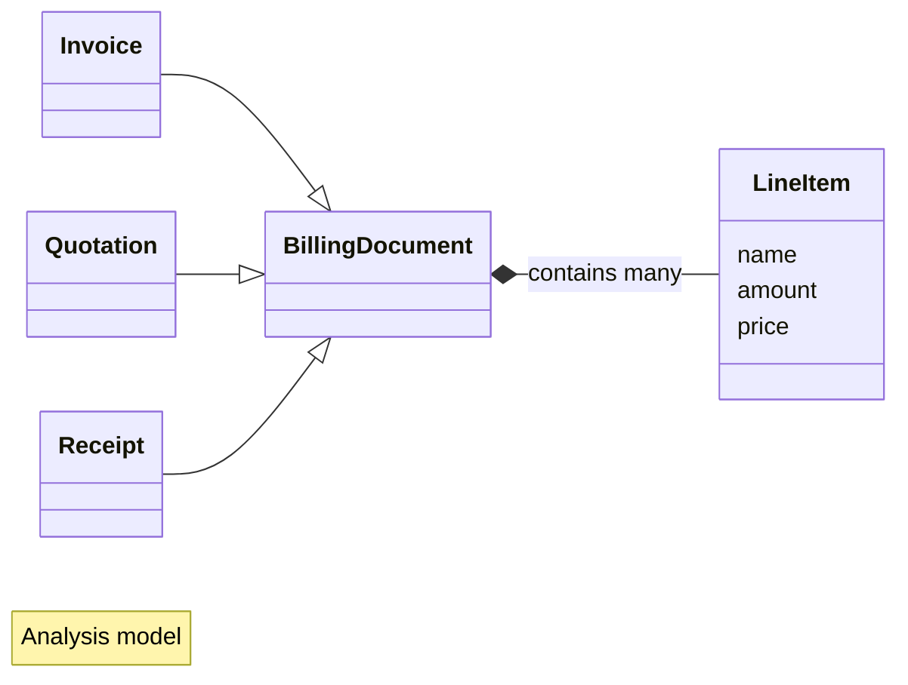

# Analysis model

Analysis model คือ model ที่สะท้อนความเป็นจริงใน domain ของปัญหานี้ จะต่างกับ Design model ที่สะท้อน design ของระบบ

## Billing archive

Billing archive เป็น collection ของ billing document หลาย ๆ ใบ ในระบบนี้เราจะแบ่งเก็บตามปี

## Billing document

Billing document มี 3 ประเภท คือ
ใบเสนอราคา (Qutation), ใบแจ้งหนี้ (Invoice) และ ใบเสร็จ (Receipt)

บางครั้งใบเสร็จจะใช้เป็นใบกำกับภาษีในตัว (Tax Invoice) ซึ่งในองค์กรเราก็เลือกจะทำแบบนั้นเช่นกัน (Receipt / Tax Invoice)

LineItem คือแต่ละรายการในใบเสร็จ ซึ่งจะมีชื่อ (name), จำนวน (amount) และ ราคาต่อหน่วย (price)
