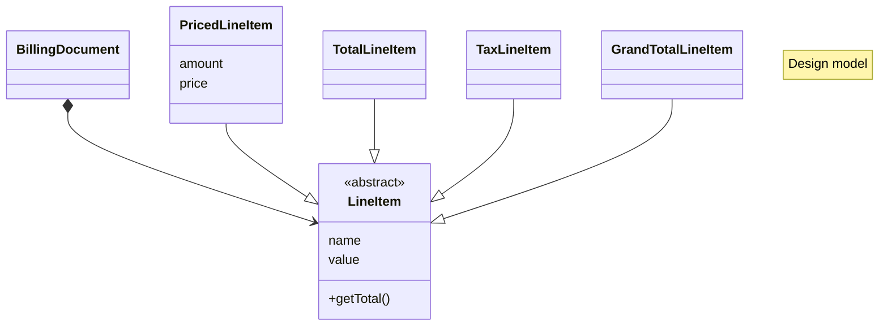
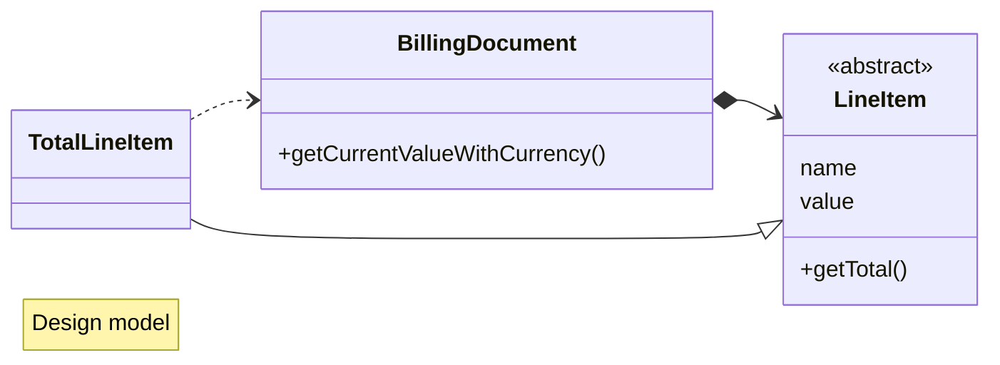

# Design model

Design model สะท้อนการออกแบบของระบบ ซึ่งจะได้แรงบันดาลใจจาก Analysis model โดยเฉพาะชื่อต่าง ๆ เพื่อให้เข้าใจง่าย อย่างไรก็ดี design model มักจะแตกต่างไป เพราะต้องออกแบบให้ระบบทำงานได้และบำรุงรักษาได้ง่ายเป็นหลัก

## LineItem

ใน Billing Document 1 ใบ จะมีหลาย ๆ รายการ (LineItems) ซึ่ง LineItem มี 4 ประเภท คือ

- Priced : Item ที่มีราคาต่อหน่วย
- Total : รวมค่าสินค้า / บริการจากทุก PricedLineItem ใน Billing Document นั้นๆ
- Tax : ค่าภาษีมูลค่าเพิ่ม 7% จากค่า Total
- GrandTotal : รวมค่า Total และ Tax

## การคำนวณ Total

การคำนวณ total ของใบแจ้งหนี้ ต้องเปลี่ยน real time ตามจำนวน LineItem ที่เพิ่มลดทันที และสะท้อน currency ที่เลือกใน Billing Document ด้วย ทำให้ LineItem ต้องมี dependency กับ Billing Document ด้วย
